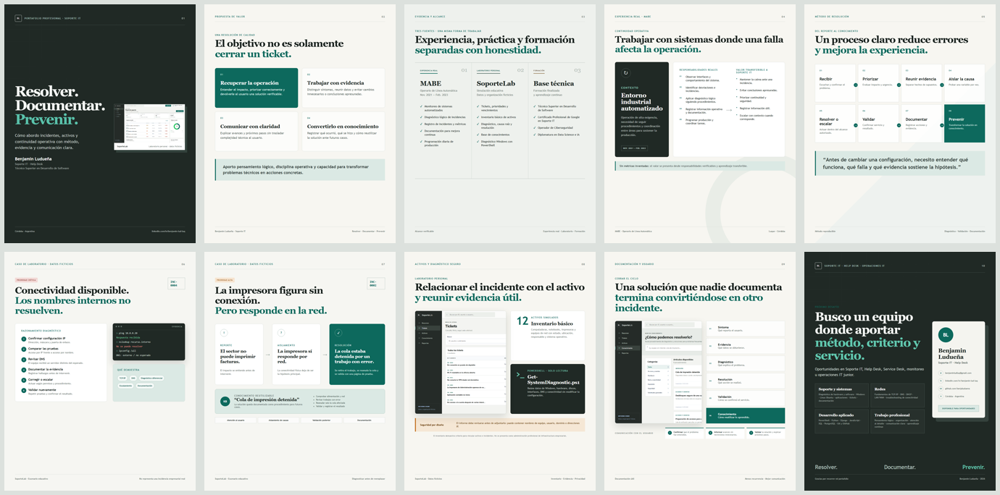

# Portafolio de Soporte IT — Benjamin Ludueña

Portafolio profesional orientado a búsquedas de **Soporte IT, Help Desk, Service Desk, monitoreo y operaciones IT junior**.

La pieza principal es un carrusel de diez páginas para LinkedIn. El repositorio también incluye una copia reproducible de **SoporteLab**, un laboratorio personal de mesa de ayuda construido con datos completamente ficticios.

[](https://benjaluduena.github.io/portfolio-soporte-it/)

## Entregables listos

- [Ver el portafolio interactivo](https://benjaluduena.github.io/portfolio-soporte-it/)
- [Portafolio PDF para LinkedIn](dist/Benjamin_Luduena_Portafolio_Soporte_IT.pdf)
- [Video demostrativo de 68 segundos](dist/Benjamin_Luduena_Demo_SoporteLab.mp4)
- [Vista previa de las diez páginas](dist/contact-sheet.png)
- [Texto de publicación](publicacion/publicacion-linkedin.md)
- [Contenido para el perfil](publicacion/perfil-linkedin.md)

## Ver el portafolio

Abrir [`index.html`](index.html) en Chrome o Edge. Las flechas del teclado permiten recorrer las páginas.

Para generar todos los entregables en Windows PowerShell:

```powershell
.\scripts\build-all.ps1
```

Los resultados se guardan en `dist/`:

- `Benjamin_Luduena_Portafolio_Soporte_IT.pdf`
- `slides/slide-01.png` a `slide-10.png`
- `Benjamin_Luduena_Demo_SoporteLab.mp4`

## Estructura

```text
assets/screenshots/   Capturas verificables de SoporteLab
dist/                 Entregables generados
publicacion/          Textos preparados para LinkedIn
scripts/              Exportación y validaciones
soportelab/            Copia del laboratorio personal
video/                 Fuente visual del video demostrativo
index.html             Carrusel editable
styles.css             Sistema visual e impresión
```

## Alcance y honestidad

- La experiencia en MABE es experiencia laboral real como **Operario de Línea Automática**, de noviembre de 2021 a febrero de 2023.
- SoporteLab es un proyecto personal educativo. Su organización, usuarios, activos, incidentes y métricas son ficticios.
- Las métricas del laboratorio no se presentan como resultados laborales.
- El inventario simulado no se describe como administración profesional de infraestructura empresarial.
- El portafolio no atribuye experiencia práctica con Active Directory, Windows Server, VMware, Zabbix, Nagios, PRTG, Docker, CI/CD, Power BI, Go, FastAPI, Flask, BigQuery, microservicios o colas de mensajería.

## Tecnologías realmente utilizadas

### Portafolio

- HTML, CSS y JavaScript sin dependencias externas
- Chrome o Edge en modo headless para PDF y capturas
- ffmpeg para el video MP4

### SoporteLab

- Python
- Django 5.2 LTS
- SQLite
- HTML, CSS y JavaScript
- PowerShell

## SoporteLab

La aplicación permite practicar el flujo completo de una incidencia: registro, priorización, diagnóstico, resolución, validación y documentación. Incluye tickets, inventario básico, historial, base de conocimientos y un script PowerShell de diagnóstico Windows de solo lectura.

Consultar [`soportelab/README.md`](soportelab/README.md) para la instalación local.

## Contacto

- LinkedIn: <https://linkedin.com/in/benjamin-lud-luq>
- GitHub: <https://github.com/benjaluduena>
- Repositorio: <https://github.com/benjaluduena/portfolio-soporte-it>
- Portafolio web: <https://benjaluduena.github.io/portfolio-soporte-it/>
- Email: <benjaminludluq@gmail.com>

## Licencia

Código publicado con licencia MIT. El contenido profesional y los textos pueden reutilizarse únicamente con atribución a Benjamin Ludueña.
