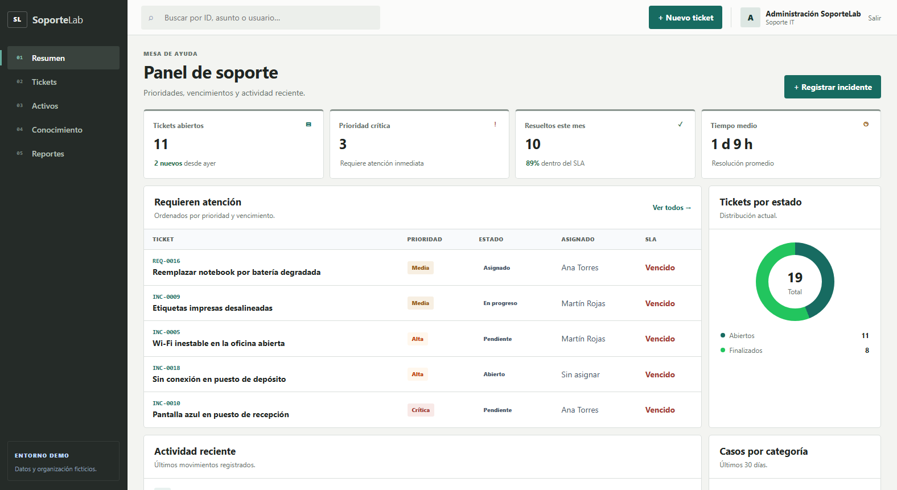

# SoporteLab

SoporteLab es un simulador de mesa de ayuda IT construido como proyecto personal.
Permite practicar el flujo completo de un incidente —registro, priorización,
diagnóstico, resolución y documentación— en un entorno sencillo, reproducible y
con datos totalmente ficticios.

> Este repositorio es un proyecto educativo. No representa una implementación
> productiva ni experiencia laboral para una empresa o cliente.

## Funcionalidades

- Panel con tickets activos, vencidos y métricas de resolución.
- Gestión de incidentes y solicitudes con prioridad, estado y fecha límite.
- Inventario básico de computadoras, impresoras y equipos de red.
- Historial de actividades y cambios por ticket.
- Registro de diagnóstico, causa raíz y resolución.
- Base de conocimientos con procedimientos reutilizables.
- Escenario de demostración reproducible mediante un comando de Django.
- Diagnóstico de Windows de solo lectura mediante PowerShell.

## Vista previa



Más capturas: [ticket con historial](docs/screenshots/ticket-detail.png),
[inventario](docs/screenshots/assets.png) y
[base de conocimiento](docs/screenshots/knowledge.png).

## Tecnologías

- Python 3.11 o superior
- Django 5.2 LTS
- SQLite
- HTML, CSS y JavaScript con diseño responsive propio
- PowerShell 5.1 o superior para la herramienta de diagnóstico

## Instalación local

En Windows PowerShell:

```powershell
git clone <URL-DEL-REPOSITORIO>
Set-Location SoporteLab
python -m venv .venv
.\.venv\Scripts\Activate.ps1
python -m pip install -r requirements.txt
python manage.py migrate
python manage.py seed_demo
python manage.py runserver
```

Abrir `http://127.0.0.1:8000/` en el navegador.

El comando `seed_demo` puede ejecutarse más de una vez: actualiza el escenario
conocido sin duplicar usuarios, categorías, activos, tickets ni artículos.

## Usuarios de demostración

| Usuario | Contraseña | Rol simulado |
| --- | --- | --- |
| `admin` | `SoporteLab2026!` | Administrador |
| `tecnico.ana` | `Demo2026!` | Técnica de soporte |
| `tecnico.martin` | `Demo2026!` | Técnico de soporte |
| `solicitante` | `Demo2026!` | Usuario solicitante |

Las credenciales son exclusivamente locales. No deben reutilizarse ni publicarse
en una instalación accesible desde Internet.

## Herramienta de diagnóstico

[`tools/Get-SystemDiagnostic.ps1`](tools/Get-SystemDiagnostic.ps1) consulta datos
del sistema operativo, memoria, procesador, discos, interfaces de red, DNS y
conectividad. No cambia la configuración del equipo y no necesita ejecutarse como
administrador.

```powershell
.\tools\Get-SystemDiagnostic.ps1
```

Los informes se guardan en `tools/reports/`, una ruta ignorada por Git porque
pueden contener nombres de equipo, usuario, dominio y direcciones IP. Conviene
revisar siempre el JSON antes de compartirlo o adjuntarlo a un ticket.

## Datos de demostración

El escenario incluye usuarios, categorías, activos, tickets con distintos estados
y prioridades, actividades y artículos técnicos. Todos los nombres, equipos,
incidentes y métricas son ficticios y existen únicamente para mostrar el flujo de
la aplicación.

Para recuperar una base limpia durante el desarrollo, eliminá manualmente tu base
SQLite local, ejecutá las migraciones y luego cargá nuevamente el escenario:

```powershell
python manage.py migrate
python manage.py seed_demo
```

## Verificación

```powershell
python manage.py check
python manage.py test
```

## Estructura principal

```text
assets/       Inventario de equipos
knowledge/    Base de conocimientos
tickets/      Tickets, categorías, actividades y carga demo
core/         Panel y vistas compartidas
tools/        Herramientas auxiliares de diagnóstico
docs/         Material de presentación del proyecto
```

## Alcance

SoporteLab prioriza una demostración clara y fácil de instalar. No intenta competir
con plataformas ITSM completas ni incluye integraciones de correo, descubrimiento
automático de red, agentes remotos, SSO o despliegue de producción.

## Presentación

En [`docs/linkedin.md`](docs/linkedin.md) hay una descripción honesta para LinkedIn,
un texto de publicación y un guion breve para grabar una demostración.

## Licencia

[MIT](LICENSE). Proyecto publicado con fines educativos y de portfolio.
